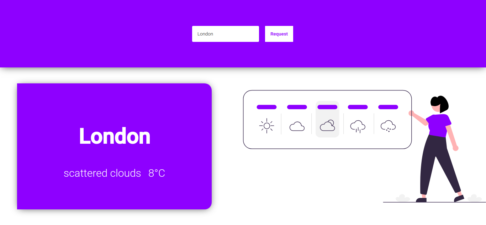

<h1 align=center>Weater App</h1>
<a href="https://nextjs.org/">Next.js</a>
<br>
<a href="https://openweathermap.org/api">Open Weather</a>

<br><br>


<h3 align=center>Getting Started</h3>
<h5>Clone this repository</h5>

```bash
git clone https://github.com/xmaz10/Next--WeatherApp.git
```

<h5>Enter path</h5>

```bash
cd Next--WeatherApp
```

<h5>Install dependecies</h5>
<h6>Yarn</h6>

```bash
yarn
```

<h6>Npm</h6>

```bash
npm install
```

<h5>Create local environment file</h5>
<h6>you need <a href="https://openweathermap.org/api">open weather</a> key</h6>
<h6>Example:</h6>

```bash
echo KEY=32a5d6ff1b5992a6166890b06d6851fd > .env.local
```

<h5>Development</h5>
<h6>Yarn</h6>

```
yarn dev
```

<h6>Npm</h6>

```
npm run dev
```

<h6>Now acess <a href="http://localhost:3000">http://localhost:3000</a></h6>

<br><br>

<h5>Build</h5>
<h6>Yarn</h6>

```
yarn build
```

<h6>Npm</h6>

```
npm run build
```